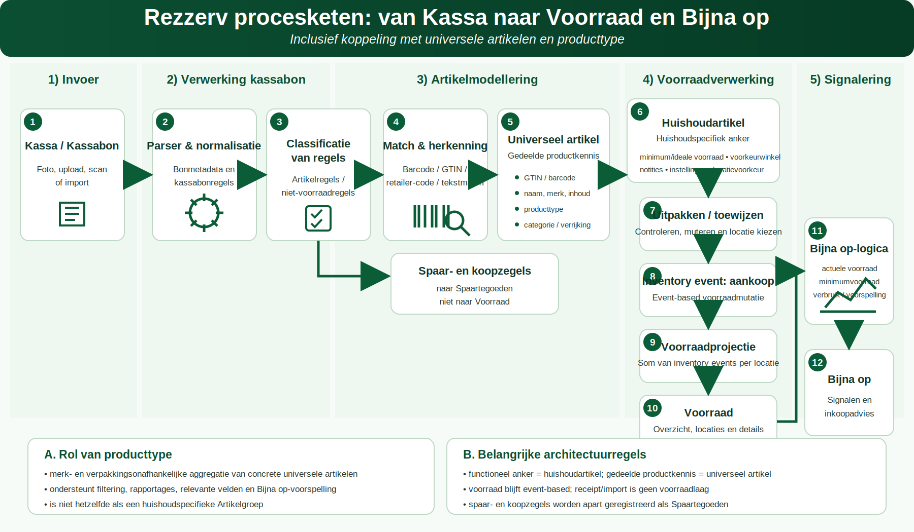

# Rezzerv-procesketen: van Kassa naar Voorraad en Bijna op

**Status:** normatieve functionele en technische documentatie  
**Scope:** Kassa, kassabonverwerking, artikelmodellering, Uitpakken, voorraadverwerking en Bijna op  
**Gerelateerde domeinen:** universele artikelen, producttype, huishoudartikelen, locaties, inventory events en Spaartegoeden

Onderstaand schema beschrijft de totale keten van Kassa en kassabonverwerking via artikelmodellering en voorraadverwerking tot en met de signalering **Bijna op**. Het schema maakt ook zichtbaar waar universele artikelen, producttypen en huishoudartikelen in de keten horen en waarom spaar- en koopzegels niet naar Voorraad gaan.

*Figuur 1. Rezzerv-procesketen van Kassa naar Voorraad en Bijna op, inclusief universele artikelen, producttype en Spaartegoeden.*

## 1. Invoer via Kassa

De keten start bij **Kassa**. Een kassabon kan binnenkomen als foto, upload, scan, e-mail, digitale bon of toekomstige externe import. De bron wordt opgeslagen als receipt-/kassabonrecord met herleidbare broninformatie.

Kassa is een **invoerkanaal**. Een kassabon is nog geen voorraadmutatie en een kassabonregel is nog geen voorraadartikel.

## 2. Parser en normalisatie

De Receipt Ingestion-laag verwerkt de bron naar bonmetadata en kassabonregels. Hierbij worden onder andere winkelketen, aankoopdatum, regeltekst, hoeveelheid, eenheid, prijs en totaalbedrag herkend en genormaliseerd.

De ruwe bron blijft auditbaar. Genormaliseerde waarden worden gebruikt voor review, matching en vervolgverwerking.

## 3. Classificatie van kassabonregels

Iedere regel wordt functioneel geclassificeerd. De belangrijkste uitkomsten zijn:

- artikelregel die mogelijk naar Uitpakken en Voorraad kan;
- korting, betaling, subtotaal of andere niet-voorraadregel;
- spaar- of koopzegelregel;
- regel die nog handmatige beoordeling nodig heeft.

Deze classificatie voorkomt dat niet-fysieke waarden als voorraad worden geboekt.

### Spaar- en koopzegels

Spaar- en koopzegels zijn immateriële spaartegoeden. Ze worden als afzonderlijke transacties geregistreerd en geaggregeerd in **Spaartegoeden**. Ze maken geen `inventory_event` aan en verhogen de fysieke voorraad niet.

## 4. Match en herkenning

Voor artikelregels zoekt Rezzerv naar een betrouwbare identiteit. De voorkeursvolgorde is:

1. barcode, GTIN, EAN of UPC;
2. winkel-/retailerartikelcode;
3. reeds bekende productidentiteit;
4. gecontroleerde tekstmatch;
5. reviewbare externe kandidaat of handmatige keuze.

Onzekere matches blijven voorstel of reviewinput. Zij worden niet stilzwijgend omgezet in definitieve product- of voorraadwaarheid.

## 5. Universeel artikel

Het **universele artikel** representeert één concreet, identificeerbaar product dat door meerdere huishoudens kan worden hergebruikt. Deze laag bevat gedeelde productkennis, zoals:

- GTIN/barcode en andere productidentiteiten;
- universele productnaam;
- merk en variant;
- inhoud, gewicht of volume;
- verrijking uit externe bronnen;
- koppeling aan een producttype.

Het universele artikel bevat geen huishoudspecifieke minimumvoorraad, notities of voorraadlocatie.

## 6. Producttype

Het **producttype** is de merk- en verpakkingsonafhankelijke aggregatielaag boven concrete universele artikelen. Voorbeelden:

- `Campina Halfvolle Melk 1 L` is een universeel artikel;
- `Halfvolle koemelk` is het producttype;
- `Zuivel` kan een huishoudspecifieke Artikelgroep zijn.

Producttype en Artikelgroep mogen niet worden verwisseld:

- producttype is centrale semantische productkennis;
- Artikelgroep is vrije huishoudspecifieke ordening.

Het producttype ondersteunt:

- aggregatie over merken en verpakkingen;
- filters en rapportages;
- keuze van relevante artikelvelden;
- productverrijking en classificatie;
- toekomstige verbruiks- en Bijna op-voorspellingen.

Een onbevestigde producttypemapping wordt niet stil meegerekend in aggregaties.

## 7. Huishoudartikel als functioneel anker

Het **huishoudartikel** is het functionele artikelanker binnen één huishouden. Het verwijst waar mogelijk naar een universeel artikel, maar draagt de huishoudspecifieke keuzes:

- eigen artikelnaam indien gewenst;
- minimumvoorraad en ideale voorraad;
- voorkeurwinkel;
- Artikelgroep;
- notities en instellingen;
- voorkeurslocatie en afboekgedrag.

Frontend- en voorraadhandelingen gebruiken `household_article_id` als anker. Niet een losse naam, GTIN of inventory-id.

## 8. Uitpakken en toewijzen

Een herkende aankoopregel wordt eerst een importregel in **Uitpakken**. De gebruiker kan daar:

- de artikelmatch controleren of corrigeren;
- hoeveelheid en prijs controleren;
- een bestaand huishoudartikel kiezen of een nieuwe koppeling maken;
- ruimte en zo nodig sublocatie kiezen;
- regels negeren of parkeren;
- geselecteerde geldige regels verwerken.

Een regel mag pas naar Voorraad wanneer minimaal huishoudartikel, hoeveelheid en geldige doellocatie bekend zijn.

## 9. Inventory event: aankoop

Verwerken vanuit Uitpakken schrijft een `purchase`-gebeurtenis naar `inventory_events`. Dit event bevat minimaal het huishoudartikel, de hoeveelheid, locatie, bron en herleidbare aankoopcontext.

De verwerking moet idempotent zijn: dezelfde importregel mag bij herhalen niet nogmaals voorraad toevoegen.

Andere eventtypen zijn onder meer:

- `consume` voor verbruik;
- `adjustment` voor een correctie;
- `transfer` voor verplaatsen;
- `expiry` voor vervallen of weggooien;
- `return` voor retour of terugboeking.

## 10. Voorraadprojectie

De actuele voorraad is een projectie van inventory events per huishoudartikel en locatie. De projectie is dus afgeleid; de auditbare gebeurtenissen vormen de mutatiegeschiedenis.

Conceptueel geldt:

`actuele voorraad = aankopen + positieve correcties - verbruik - verval - retour ± transfers`

Een transfer verandert de locatieverdeling maar niet het totaal van het huishoudartikel.

## 11. Voorraad

Het scherm **Voorraad** toont de actuele projectie per huishoudartikel en locatie. Vanuit Voorraad kunnen bevoegde gebruikers onder andere:

- voorraad bekijken en filteren;
- Artikeldetail openen;
- afboeken;
- corrigeren;
- verplaatsen;
- huishoudspecifieke instellingen beheren.

Voorraad leest geen ruwe kassabonregels als voorraadwaarheid.

## 12. Bijna op-logica

**Bijna op** gebruikt de actuele voorraadprojectie en de huishoudspecifieke instellingen. De basisbeoordeling combineert:

- actuele voorraad;
- minimumvoorraad;
- eventueel ideale voorraad;
- historisch verbruik;
- ingestelde of berekende voorspelhorizon;
- waar relevant de aggregatie op producttype.

De eenvoudige basisregel is dat een artikel bijna op is wanneer de bruikbare voorraad onder de geldende minimumgrens komt. Een uitgebreidere voorspelling kan eerder signaleren wanneer verwacht verbruik de voorraad binnen de voorspelhorizon onder die grens brengt.

Bij producttype-aggregatie moet zichtbaar en uitlegbaar blijven uit welke concrete universele artikelen, huishoudartikelen en locaties het totaal bestaat.

## 13. Bijna op en inkoopadvies

Het scherm **Bijna op** presenteert signalen en vormt input voor een toekomstig boodschappen- of inkoopadvies. Een signaal wijzigt de voorraad niet zelfstandig.

Een toekomstige automatische actie vereist expliciete productregels, toestemming en uitschakelbaarheid. Inzichten blijven afgeleid van de voorraad-SSOT.

## 14. Architectuurregels voor de totale keten

1. Kassa en receipt ingestion zijn invoerlagen, geen voorraadlaag.
2. Kassabonregels worden eerst geclassificeerd en beoordeeld.
3. Universele artikelen bevatten gedeelde concrete productkennis.
4. Producttypen vormen een centrale merk- en verpakkingsonafhankelijke aggregatielaag.
5. Huishoudartikelen zijn het functionele anker voor gebruikershandelingen.
6. Voorraad is event-based en per locatie herleidbaar.
7. Uitpakken vormt de gecontroleerde overgang van aankoopregel naar inventory event.
8. Bijna op gebruikt de voorraadprojectie en huishoudspecifieke grenzen.
9. Spaar- en koopzegels gaan naar Spaartegoeden en nooit naar fysieke Voorraad.
10. Onzekere matches, mappings of voorspellingen blijven zichtbaar reviewbaar en worden niet stil als waarheid verwerkt.

## 15. Ketenacceptatiecriteria

De totale keten is functioneel geborgd wanneer:

- een kassabon herleidbaar kan worden ingelezen en geparseerd;
- artikel- en niet-voorraadregels correct worden gescheiden;
- spaar- en koopzegels uitsluitend in Spaartegoeden terechtkomen;
- een artikelregel controleerbaar aan een universeel artikel en huishoudartikel kan worden gekoppeld;
- producttype en Artikelgroep aantoonbaar gescheiden blijven;
- Uitpakken alleen geldige regels met locatie verwerkt;
- verwerking exact één aankoop-event per importregel schrijft;
- de voorraadprojectie overeenkomt met de inventory events;
- Voorraad alleen gegevens van het actieve huishouden toont;
- Bijna op dezelfde voorraadprojectie en huishoudinstellingen gebruikt;
- elk signaal doorklikbaar en uitlegbaar blijft tot huishoudartikel, locatie en mutatiebron.
